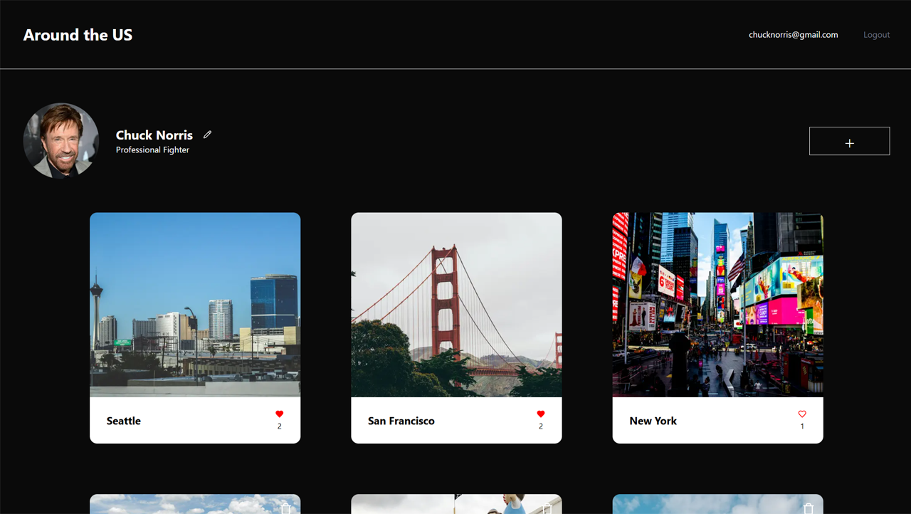

# Around the US - NEXTJS
A modern web application built with Next.js 15, featuring authentication, animations, and a beautiful user interface.


*Replace this with your actual homepage screenshot*

## 🚀 Features

- **Modern Tech Stack**
  - Next.js 15 with App Router
  - TypeScript for type safety
  - Tailwind CSS for styling
  - GSAP for smooth animations
  - MongoDB with Mongoose for data persistence

- **Authentication & Security**
  - Secure user authentication
  - JWT-based session management
  - Password hashing with bcrypt
  - Protected routes with middleware

- **UI/UX**
  - Responsive design
  - Dark/Light mode support
  - Toast notifications with Sonner
  - Smooth animations and transitions
  - Modern component library with Lucide icons


*Replace this with a screenshot showcasing key features*

## 📋 Prerequisites

Before you begin, ensure you have the following installed:
- Node.js (Latest LTS version recommended)
- npm or yarn
- MongoDB (local or Atlas)

## 🛠️ Installation

1. Clone the repository:
```bash
git clone [your-repository-url]
cd tripleten
```

2. Install dependencies:
```bash
npm install
# or
yarn install
```

3. Set up environment variables:
Create a `.env.local` file in the root directory with the following variables:
```env
MONGODB_URI=your_mongodb_connection_string
JWT_SECRET=your_jwt_secret
```

4. Run the development server:
```bash
npm run dev
# or
yarn dev
```

Open [http://localhost:3000](http://localhost:3000) to view the application.


*Replace this with a screenshot of your development environment*

## 🏗️ Project Structure

```
tripleten/
├── app/              # Next.js app directory
├── components/       # Reusable UI components
├── lib/             # Utility functions and configurations
├── models/          # MongoDB models
├── actions/         # Server actions
├── public/          # Static assets
└── middleware.ts    # Next.js middleware
```

## 🚀 Deployment  

The application is **live**! You can access it here:  
👉 [**Around the US - NEXTJS**](https://tripleten-nextjs.vercel.app/)  

Additionally, if you'd like to deploy your own version, you can easily do so on Vercel:  

[](https://vercel.com/new/clone?repository-url=https%3A%2F%2Fgithub.com%2Fyourusername%2Ftripleten)


## 🛠️ Development

- `npm run dev` - Start development server with Turbopack
- `npm run build` - Build for production
- `npm run start` - Start production server
- `npm run lint` - Run ESLint

## 📝 License

This project is licensed under the MIT License - see the LICENSE file for details.

## 👥 Contributing

Contributions are welcome! Please feel free to submit a Pull Request.

---

Built with ❤️ using [Next.js](https://nextjs.org)
